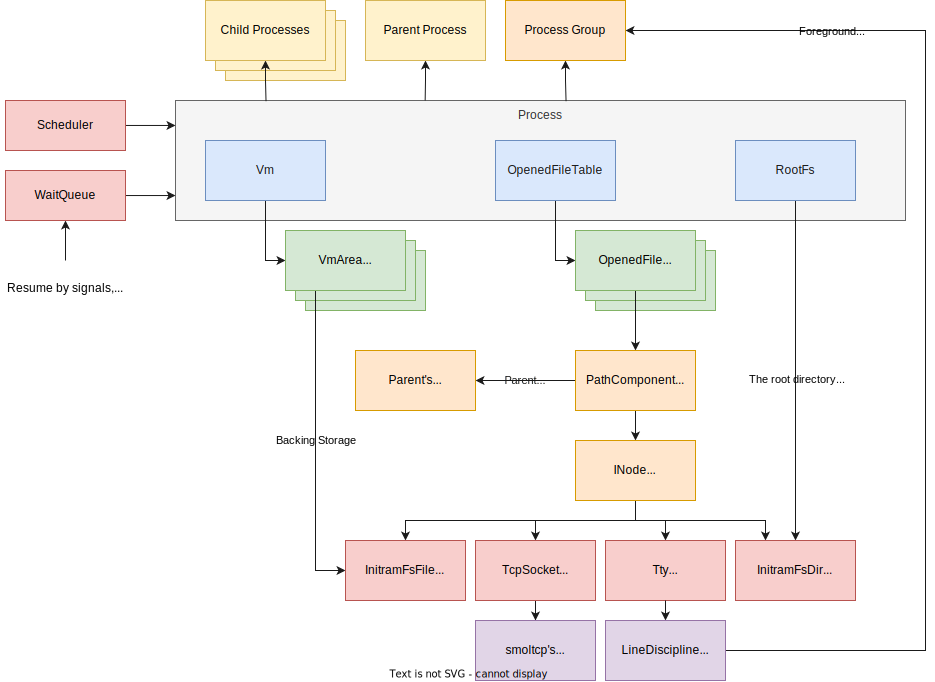

# Architecture
This document introduces the overview of Kerla's internals.

The following figure shows some important kernel objects and their relationships:

## Process
A `Process` object represents both kernel/user threads and user processes.
In addition to the execution context (`arch::Thread`) which holds such as the CPU registers,
`Process` holds some references to shared resources like opened files, memory address space,
signal-related information, etc.

You can get the current process by `current_process()`.

## WaitQueue
A `WaitQueue` object holds a queue of blocked processes waiting for a certain
event such as  child processes termination (`wait(2)`) and new data on a socket (`read(2)`).

## PathComponent
A `PathComponent` object is a node in a path tree: for example, to represent
`/foo/bar/baz.txt`, Kerla constructs nodes for each component `foo`, `bar`, and `baz.txt` as
`PathComponent`. PathComponent for `baz.txt` holds its name (`bar.txt`), a reference to
the parent node (`bar`'s PathComponent), and the reference to `bar.txt`'s inode.

## INode
INode represents a file system (or peudo-file) object enum type of:

- `dyn FileLike`: An object behaves like a file: regular files, unnamed pipes, sockets, `/dev/null`, etc.
- `dyn Directory`: A directory object: implements readdir-like operations.
- `dyn Symlink`: A symbolic link object.

## FileLike
FileLike is a trait represeting file-like operations such as reading and writing
file contents.
