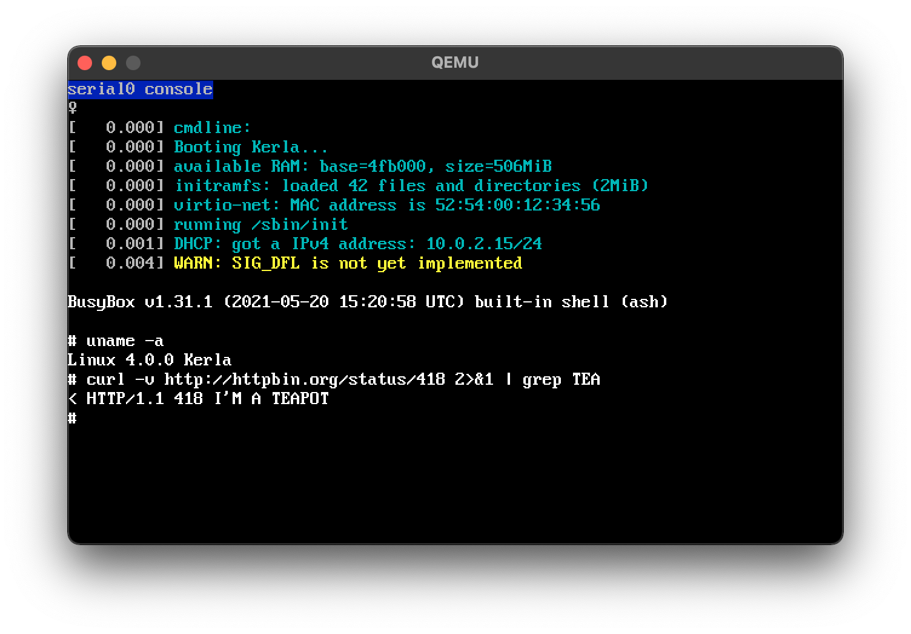

# Kerla



Kerla is a monolithic operating system kernel written from scratch in Rust which aims to be
compatible with the Linux ABI, that is, it runs Linux binaries without any modifications.

- Implements *NIX process concepts: context switching, signals, `fork(2)`, `execve(2)`, `wait4(2)`, etc.
- Supports commonly used system calls like `write(2)`, `stat(2)`, `mmap(2)`, `pipe(2)`, `poll(2)`, ...
- No disk support for now: initramfs is mounted as the root file system.
- Pseudo file systems: tmpfs and devfs.
- [smoltcp](https://github.com/smoltcp-rs/smoltcp)-based TCP/IP support.
- Implements tty and pseudo terminal (pty).
- Supports QEMU and Firecracker (with virtio-net device driver).
- Supports x86_64.
- Docker-based initramfs build system.

***Check out [my blog post](https://seiya.me/writing-linux-clone-in-rust) for motivation and my thoughts on writing an OS kernel in Rust.***

> [!IMPORTANT]
> 
> This software is no longer maintained. If you are interested in a modern OS written in Rust, check out my new project **[Starina](https://starina.dev)**.

## Demo: SSH into Kerla!

You can play with Kerla over ssh. Your login is not visible from others (except
me): we automatically launch a dedicated microVM on Firecracker for each TCP
connection.

```
$ ssh root@demo.kerla.dev
```

If you found bugs or missing features, let me know on GitHub issues :)

## Running a Docker Image (experimental)

You can run a Docker image as a root file system (not as a container!) on Kerla Kernel instead of our initramfs built from `initramfs` directory.

For example, to run [nuta/helloworld](https://hub.docker.com/r/nuta/helloworld) image ([Dockerfile](https://gist.github.com/nuta/4c9ecd0d1a401dc5be88095bea5a991a)), try the following command:

```
$ make IMAGE=nuta/helloworld run
...
[   0.029] syscall: execve(439398, 4393b8, 4393c8, 8, 2f2f2f2f2f2f2f2f, 8080808080808080)
[   0.030] syscall: arch_prctl(1002, 4055d8, 0, 20000, 0, ff)
[   0.031] syscall: set_tid_address(4057f0, 4055d8, 0, 20000, 0, ff)
[   0.033] syscall: ioctl(1, 5413, 9ffffeed0, 1, 405040, 9ffffeef7)

 _          _ _                            _     _ _
| |__   ___| | | ___   __      _____  _ __| | __| | |
| '_ \ / _ \ | |/ _ \  \ \ /\ / / _ \| '__| |/ _` | |
| | | |  __/ | | (_) |  \ V  V / (_) | |  | | (_| |_|
|_| |_|\___|_|_|\___/    \_/\_/ \___/|_|  |_|\__,_(_)
```

This feature is in a very early stage and I guess **almost all images out there won't work** because:

- They tend to be too large to be embedded into the kernel image.
- They might use unimplemented features (e.g. position-independent executables used in Alpine Linux).

## Building and Running the OS

See [Quickstart](https://kerla.dev/docs/quickstart.html) for instructions on building from source, running on emulators, etc.

## Current Roadmap
[Roadmap - Run a Node.js Web Application on Kerla on Firecracker on AWS](https://github.com/nuta/kerla/projects/1)

## Compatibility

See [here](https://github.com/nuta/kerla/blob/main/Documentation/compatibility.md) for the current status.

## Contributing

Send me bug reports, feature requests, and patches on [GitHub](https://github.com/nuta/kerla) for example:

- **Implementing missing features:** majority of existing Linux applications won't work due to the lack of features.
- **Writing documentation:** I think Kerla could be good material to learn how an operating system kernel works.
- **Trying to experiment with Rust-y ideas:** for example currently I'm interested in [GhostCell](http://plv.mpi-sws.org/rustbelt/ghostcell/).

## License

See [LICENSE.md](https://github.com/nuta/kerla/blob/main/LICENSE.md).

## Related Work

Emulating Linux ABI is not a novel work. Some UNIX-like kernels like [FreeBSD](https://docs.freebsd.org/en_US.ISO8859-1/articles/linux-emulation/article.html) and [NetBSD](https://www.netbsd.org/docs/guide/en/chap-linux.html) already have their own Linux emulation layers. Windows has a well-known feature called [Windows Subsystem for Linux (WSL)](https://github.com/microsoft/WSL) which enables running Linux binaries seamlessly. WSL 1 implements the feature by ABI emulation. WSL 2 runs the real Linux kernel using the hardware-accelerated virtualization (Hyper-V).

Aside from general-purpose operating systems, there're some attractive projects related to the Linux ABI emualtion. [OSv](https://github.com/cloudius-systems/osv/wiki/OSv-Linux-ABI-Compatibility) is a unikernel which runs unmodified Linux binaries. [rCore](https://github.com/rcore-os/rCore) is a teaching operating system which implements the Linux ABI in Rust. [Noah](https://dl.acm.org/doi/10.1145/3381052.3381327) suggests an intriguing approach to run unmodified Linux binaries on macOS.
